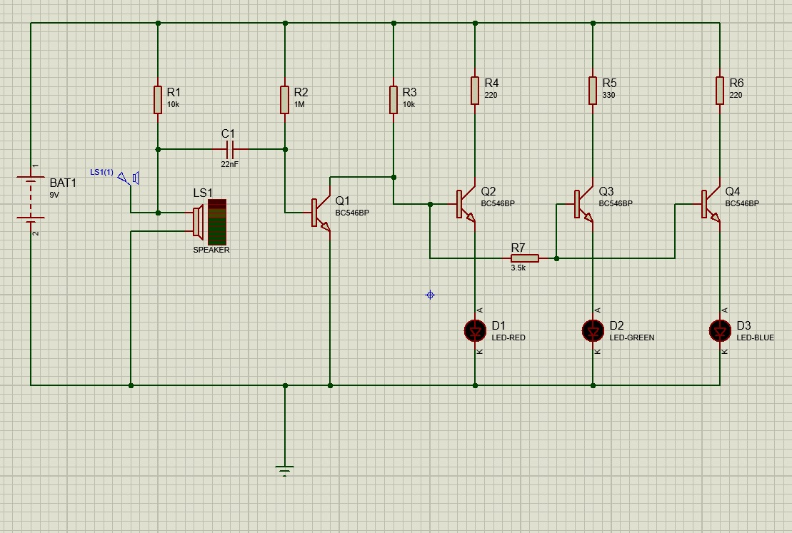
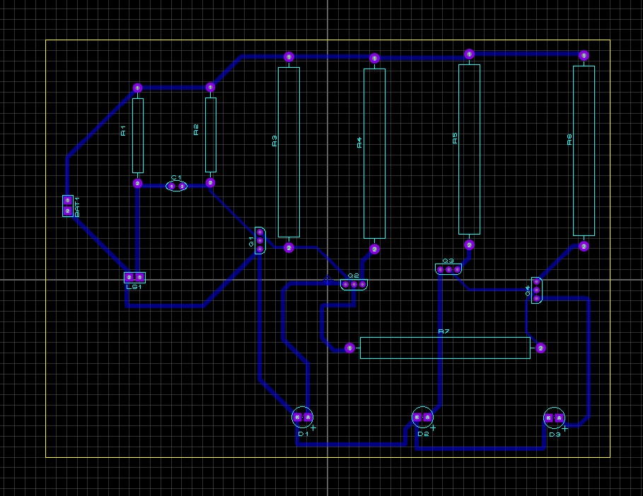
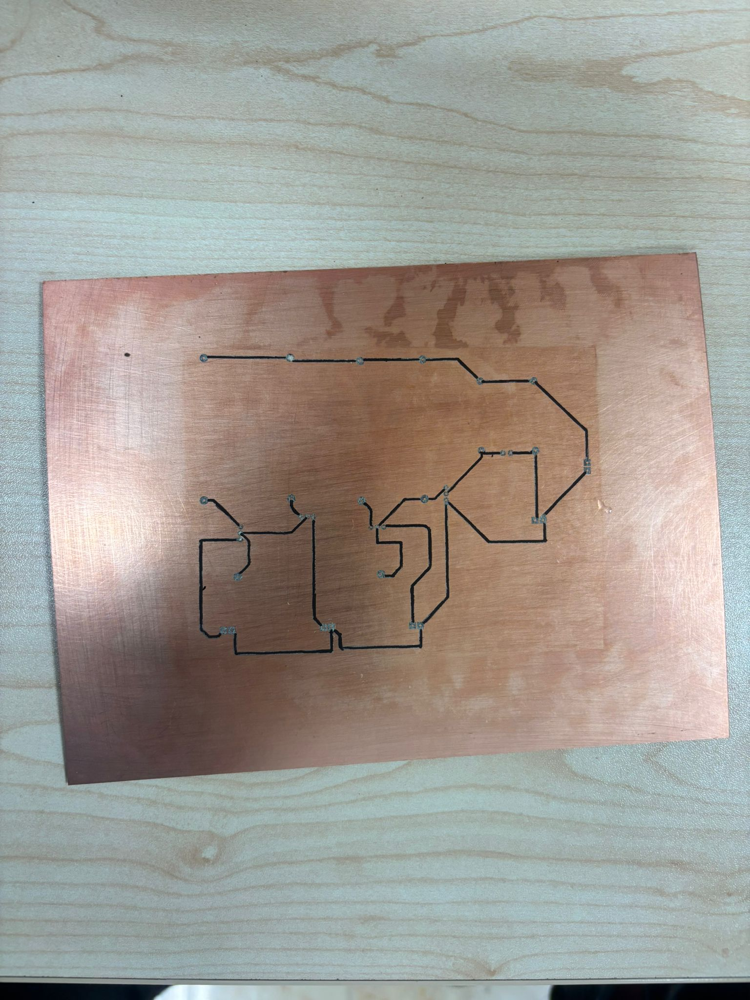
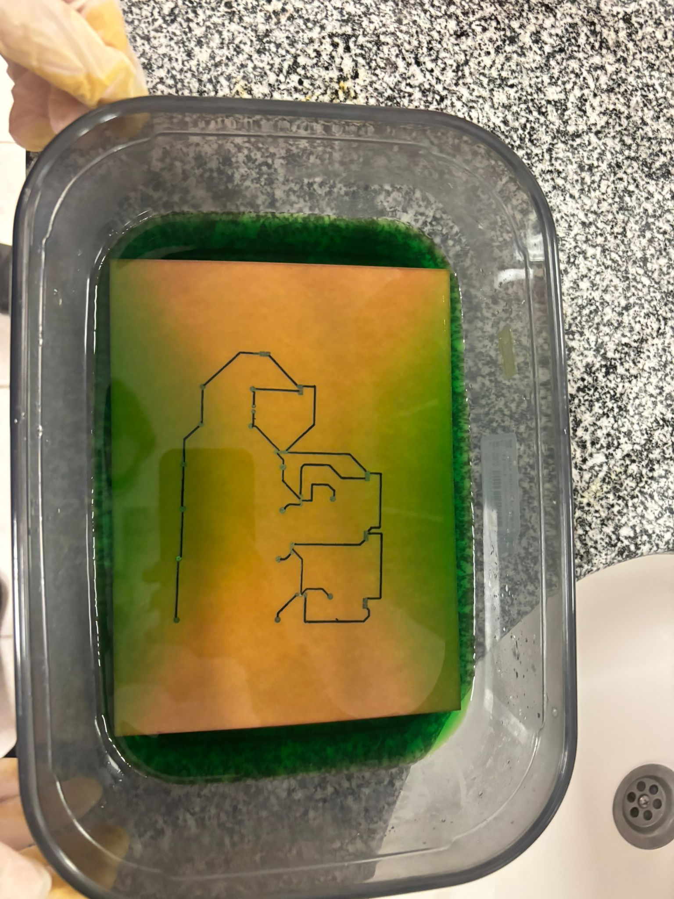
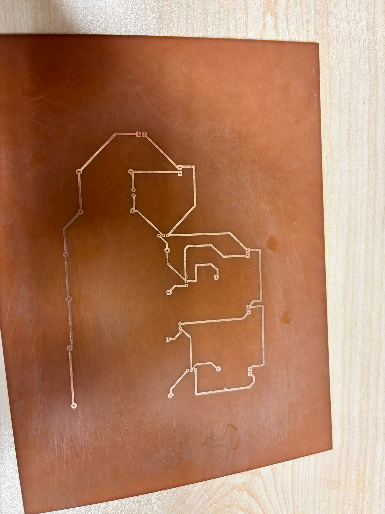
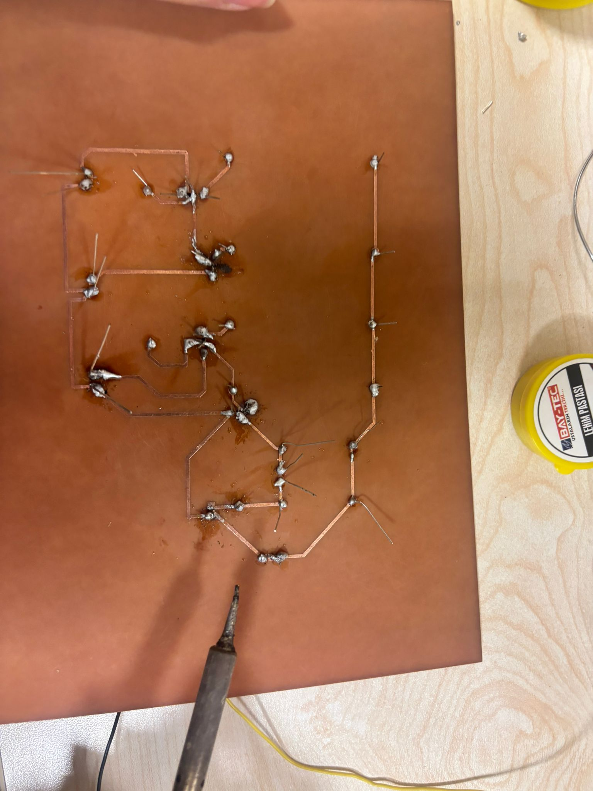
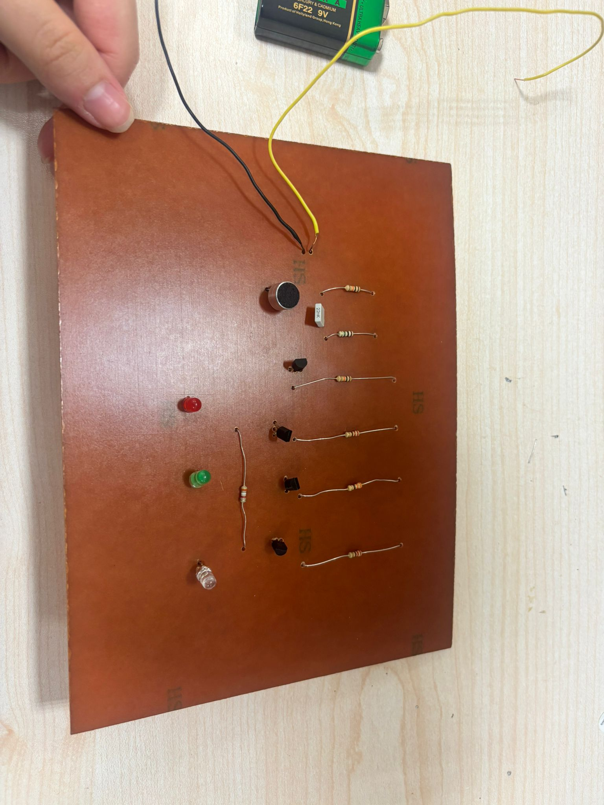

# Analog Sound Frequency LED Indicator
### Proteus Simulation & PCB Design Project

This project presents an analog electronic circuit that visualizes sound frequencies using LEDs.

The system detects sound signals through a microphone, processes the signal using RC filters, and drives LEDs using transistor amplification. Different LEDs respond to different frequency ranges, allowing the circuit to represent low, medium, and high frequency sounds visually.

## Project Features

- Analog sound signal processing
- RC frequency filtering
- Transistor amplification
- Frequency-based LED visualization
- PCB design and implementation
- Designed and simulated in Proteus

## How the Circuit Works

1. Microphone converts sound waves into electrical signals.

2. RC filters separate different frequency components of the sound signal.

3. BC546 transistors amplify the filtered signals.

4. LEDs indicate different frequency ranges:

- Red LED → Low frequencies  
- Green LED → Medium frequencies  
- Blue LED → High frequencies  

## Components Used

- BC546 Transistors  
- Resistors  
- Capacitor (22nF)  
- Microphone  
- LEDs  
- 9V Power Supply  

## Engineering Design Process

1. Circuit schematic design in Proteus
2. Circuit simulation
3. PCB layout design
4. PCB manufacturing
5. Component soldering
6. Circuit testing

## Project Report

Detailed explanation of the circuit design, calculations and PCB manufacturing process can be found in the project report.

---
## Project Images

### Proteus Circuit Design

### PCB Layout

### 3D PCB View (Front)
.jpeg)

### 3D PCB View (Back)
.jpeg)

### Copper Board Before Etching

### PCB Etching Process

### PCB Drilling

### Component Soldering

### Final PCB

## Author

Elif Tütüncü  
Electrical & Electronics Engineering Student
